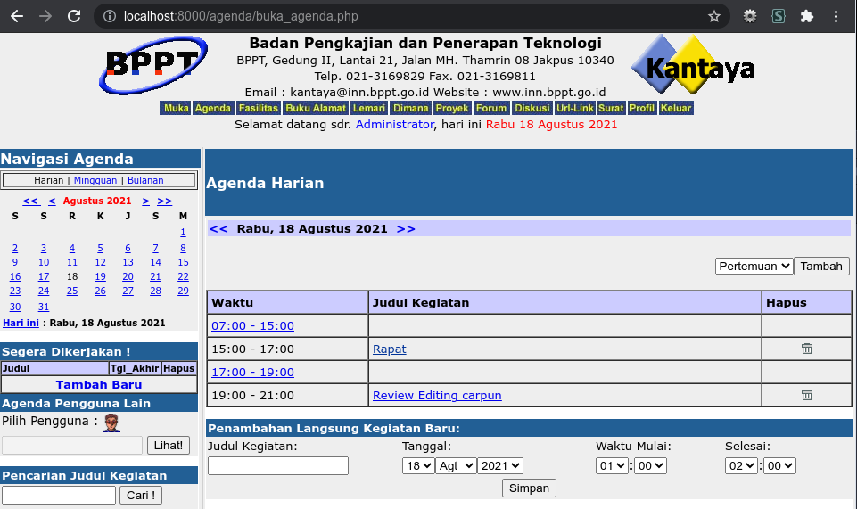

# Kantaya Docker



**Kantaya (Kantor Maya)** merupakan aplikasi web berbasis PHP yang dibuat oleh P3TIE-BPPT pada tahun 2001, dan secara resmi dirilis tanggal 26 Februari 2002, bersamaan dengan WinBI (sebuah distro Linux berbasis Trustix Merdeka) dan SITI [[1]](http://web.archive.org/web/20020328092129/http://www.inn.bppt.go.id:80/). Kantaya dan WinBI sempat tersedia di website SoftwareRI [[2]](http://web.archive.org/web/20051201065926/http://www.software-ri.or.id/), yang sayangnya mengusang sekitar pertengahan tahun 2000-an.

Dari kedua teknologi yang tersedia di website ini, hanya aplikasi Kantaya yang saya dapat temukan secara utuh, sebab software ini sempat diposting ulang di website lain (meski kini usang pula).

Deskripsi resmi Kantaya menyebutnya sebagai aplikasi *groupware*, yang ditujukan untuk organisasi, perusahaan dan situasi yang memerlukan kolaborasi. Kantaya terdiri dari beberapa modul yang analogis dengan perkakas kantor yang sebenarnya, yaitu:

- **Muka**: Homepage atau dashboard utama.
- **Agenda**: Halaman perencanaan kegiatan.
- **Fasilitas**: Pencatat pemesanan fasilitas.
- **Buku Alamat**: Analogi dengan buku alamat tradisional.
- **Almari File**: Tempat pengguna dapat menyimpan file atau dokumen pribadi.
- **Dimana?**: Fitur tracking pengguna.
- **Proyek**: Fitur pengaturan proyek.
- **Forum**: Forum dengan model mirip milis/message board.
- **Diskusi**: Model diskusi yang lebih instan dibanding forum, mirip model IRC.
- **Surat**: *E-mail client* sederhana menggunakan protokol yang umum digunakan (POP3, SMTP, IMAP).
- **URL Link**: Sederhananya, penyimpanan bookmark online.
- **Profil Pengguna**: Bagian administrasi Kantaya.

## Disclaimer

Seperti yang dijelaskan, software ini cukup jadul dan sepertinya tidak ditemukan versi yang lebih baru. Kodenya sendiri juga penuh dengan celah-celah keamanan dan penggunaan fungsi database yang kurang aman. Oleh karena itu, saya pribadi tidak menyarankan untuk menjalankan software ini untuk hal-hal yang penting - lebih baik mencari alternatif lain yang lebih modern.

Proyek ini dimaksudkan untuk melestarikan (preservation) usaha-usaha awal komunitas Open Source di Indonesia.

Folder `Kantaya` dalam repo ini merupakan versi yang telah diperbaiki untuk digunakan dalam Docker container. Versi asli dari software ini dapat ditemukan di `software_kantaya.zip`.

## Setup

Repo ini digunakan dengan `docker-compose`.

Lingkungan yang digunakan adalah MySQL 5.7, PHP 4.4, Apache 2.2 (image yang digunakan: [[3]](https://hub.docker.com/r/nouphet/docker-php4/))

1. Untuk memulai server, ketik `docker-compose up` pada terminal.
2. Setelah container-container telah siap semua, bukalah `http://localhost:8000/setup/SETUP.PHP` dalam browser. Akan muncul form setup dengan beberapa entri yang telah terisi. Cukup isi password untuk MySql Admin (lihat `MYSQL_ROOT_PASSWORD` dalam `docker-compose.yml`), password untuk Database User (lihat `MYSQL_PASSWORD` dalam `docker-compose.yml`), serta semua isian dalam Profile Instansi.
3. Klik `Setup Kantaya` dan jika semua berjalan lancar Anda akan dapat login dengan kredensial yang muncul di layar.
4. Saat ini sedikit sekali bagian dari Kantaya yang dapat digunakan, disebabkan query-query yang sudah tidak dapat bekerja lagi dalam versi MySQL yang lebih baru serta beberapa fungsi PHP yang dideprekasi.
5. Tersedia PHPmyadmin untuk saat ini, dapat diakses dengan membuka `http://localhost:8001`.

Untuk membersihkan konfigurasi container, ketik `docker-compose down`. Jika ingin menyertakan volume, tambahkan `-v`. Jika menyertakan *image*, tambahkan pula `--rmi local`

## Ceklis Fitur
Fitur-fitur yang telah diperbaiki:

- [x] Perbaiki zona waktu PHP
- [x] Setup
- [x] Login
- [x] Agenda **(sebagian)**
- [ ] Fasilitas
- [ ] Buku Alamat (tabel hilang)
- [ ] Almari File
- [ ] Dimana?
- [ ] Proyek
- [x] Forum **(sebagian)**
- [ ] Diskusi
- [ ] Surat
- [ ] URL Link (tabel hilang)
- [ ] Profil Pengguna

## Lisensi

Software ini diasumsikan berlisensi GPL v2 berdasarkan [pernyataan direktur P3TIE-BPPT](https://www.mail-archive.com/asosiasi-warnet@yahoogroups.com/msg13182.html). Dengan demikian, modifikasi ini berlisensi sama, termasuk perlengkapan Docker-isasinya (`Dockerfile`, `docker-compose.yml`).

```
Hak cipta © 2001 P3TIE-BPPT

Program ini adalah perangkat lunak bebas; Anda dapat menyebarluaskannya
dan/atau memodifikasinya di bawah ketentuan-ketentuan dari GNU General Public
License sebagaimana yang diterbitkan oleh Free Software Foundation; baik versi
2 dari Lisensi tersebut, atau (atas pilihan Anda) versi yang lebih baru.
```
